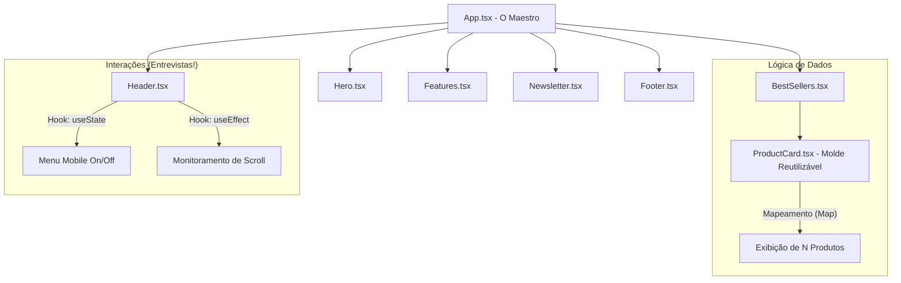

# 📚 Guia de Estudo Master: Do Vanilla ao React High-End

Este guia é o seu "Cheat Sheet" para entrevistas. Aqui explicamos as decisões técnicas que tomamos e por que elas são as melhores práticas do mercado.

---

## 🗺️ 1. O Fluxo Visual da Aplicação

O diagrama abaixo mostra como os componentes conversam entre si no "Cérebro" do React:

---

## 💡 2. Perguntas de Entrevista (O que você precisa saber)

### Q1: "Por que você componentizou o site em vez de deixar tudo no App.tsx?"
**Resposta Ideal:** "Usei o princípio de **Responsabilidade Única**. Cada componente foca em uma parte da interface. Isso facilita a manutenção, permite **Reutilização** do código e deixa o projeto escalável. Se eu precisar mudar o Rodapé, não corro o risco de quebrar o Header."

### Q2: "Por que usar `.map()` para os produtos e não escrever um por um?"
**Resposta Ideal:** "Para garantir o **DRY (Don't Repeat Yourself)**. Criamos um array de objetos (dados) e o React renderiza a interface dinamicamente. Se a loja crescer de 3 para 300 produtos, a lógica de exibição continua a mesma."

### Q3: "Para que serve a 'key' dentro do seu Map?"
**Resposta Ideal:** "A `key` é essencial para o **Algoritmo de Reconciliação** do React. Ela ajuda o React a identificar quais itens mudaram, foram adicionados ou removidos, otimizando a performance na hora de atualizar o DOM."

### Q4: "O que é o useState e o useEffect que você usou?"
**Resposta Ideal:** 
- "**useState:** É um Hook para gerenciar o **Estado Local**. Usei para controlar se o menu está aberto ou se o header deve mudar de cor."
- "**useEffect:** É usado para lidar com **Side Effects** (Efeitos Colaterais). Usei para criar um 'listener' de scroll do navegador que o React, por padrão, não monitora."

---

## 🎨 3. Design & UX (Experiência do Usuário)

### O "Glow Up" que você fez:
- **Glassmorphism:** O efeito de vidro no Header (`backdrop-blur`) comunica modernidade.
- **Mobile-First:** O site foi pensado primeiro para o celular (usando classes `md:` do Tailwind para adaptar ao desktop).
- **Hierarquia Visual:** Usamos cores vibrantes (Vermelho no badge 'Novo') para guiar o olho do usuário para onde queremos que ele clique (Conversão).

---

## 🛠️ Próximos Passos Sugeridos:
Agora que você tem o código, tente:
1. Adicionar um novo produto no array dentro de `BestSellers.tsx`.
2. Mudar uma cor de ícone em `Features.tsx`.

---
*Este documento foi criado para ajudar Célia Rocha a conquistar sua primeira vaga como Dev React. Estude e arrase!*
